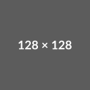

# Spoiler Blocker Chrome Extension


A Chrome extension that hides comments on YouTube videos to prevent spoilers, with an option to show them when desired.



## Features

- 🚫 Automatically hides the comments section on YouTube videos
- 🔔 Shows a temporary notification when comments are hidden
- 👁️ Provides a "Show Hidden Comments" button to reveal comments when desired
- 📺 Works on all video pages across YouTube
- 🔄 Maintains functionality when navigating between videos

## Installation

### Method 1: Local Installation (Development)
1. Download or clone this repository
   ```bash
   git clone https://github.com/prviegas/spoiler-blocker.git
   ```
2. Open Chrome and navigate to `chrome://extensions/`
3. Enable "Developer mode" in the top-right corner
4. Click "Load unpacked" and select the extension directory
5. The extension is now installed!

### Method 2: Manual Installation (Release)
1. Download the latest `spoilerblocker.zip` from the [Releases](https://github.com/prviegas/spoiler-blocker/releases) page
2. Extract the ZIP file to a folder
3. Follow steps 2-5 from Method 1

### Future: Chrome Web Store
We plan to make this extension available on the Chrome Web Store in the future.

## Usage

Simply visit any YouTube video page. The extension will automatically:
1. Hide the comments section to prevent spoilers
2. Show a small notification at the bottom-right of the screen confirming the comments have been hidden
3. Place a blue "Show Hidden Comments" button where the comments section would be
4. When you're ready to see comments, click the button to reveal them


## Customization

To modify the extension's behavior:

1. Edit `content.js` to change the alert message or add more functionality
2. Update `manifest.json` to change extension settings or permissions
3. Replace icons in the `images` folder with your own designs

## Development

### Prerequisites
- Google Chrome or Chromium-based browser
- Basic knowledge of HTML, CSS, JavaScript
- Git (optional, for version control)

### Project Structure
```
spoiler-blocker/
├── content.js         # Main script that runs on YouTube
├── manifest.json      # Extension configuration
├── images/            # Extension icons
│   ├── icon16.png
│   ├── icon48.png
│   └── icon128.png
└── README.md          # Documentation
```

### Building
Run the VS Code task to create a deployable ZIP file:
```bash
# From VS Code command palette
> Tasks: Run Build Task
```

## Contributing

1. Fork the repository
2. Create your feature branch (`git checkout -b feature/amazing-feature`)
3. Commit your changes (`git commit -m 'Add some amazing feature'`)
4. Push to the branch (`git push origin feature/amazing-feature`)
5. Open a Pull Request

## License

This project is available under the MIT License. See the [LICENSE](LICENSE) file for details.
